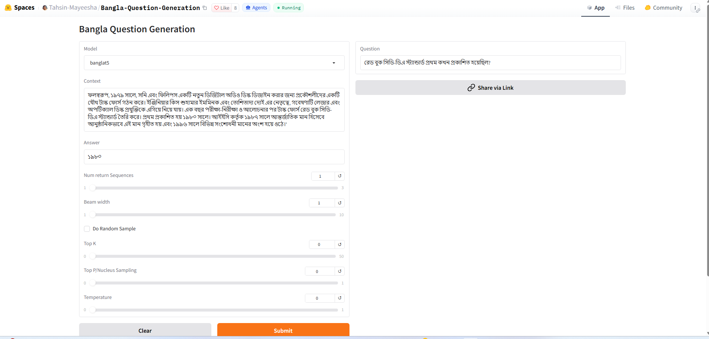

# Bangla Question Generation

This is the official release of the code, models, generated questions, and dataset for **answer-aware Bengali Question Generation (QG)** introduced in the paper:

### [Transformer based Answer-Aware Bengali Question Generation](https://doi.org/10.1016/j.ijcce.2023.09.003)

The project develops transformer-based models for generating Bengali questions from a context passage and a specified answer. The models use an **answer-aware input format**, allowing the generated question to target a particular answer while remaining relevant to the surrounding context.



## Abstract

Question generation (QG), the task of generating questions from text or other forms of data, is a significant and challenging subject that has recently attracted more attention in natural language processing (NLP) due to its wide range of applications in business, healthcare, and education, including creating quizzes, Frequently Asked Questions (FAQs), and documentation. Most QG research has been conducted in resource-rich languages such as English. However, due to the dearth of training data in low-resource languages such as Bengali, thorough research on Bengali question generation has yet to be conducted.

In this article, we propose a system for producing varied and pertinent Bengali questions from context passages in natural language using an **answer-aware input format** and a series of fine-tuned text-to-text transformer (T5)-based models. We investigate various transformer-based encoder-decoder models and decoding strategies. Our experiments achieve **98% grammatical accuracy**, while our fine-tuned **BanglaT5** model achieves the highest performance, with a **35.77 ROUGE-L F-score** and **38.57 BLEU-1 score** using beam search.

Our automated and human evaluation results show that the proposed answer-aware QG models can generate realistic, human-like questions that are relevant to both the context passage and the specified answer. We also release our **code, generated questions, dataset, and models** to enable broader research in Bengali Question Generation.

## Paper

**Transformer based Answer-Aware Bengali Question Generation**

Jannatul Ferdous Ruma, **Tasmiah Tahsin Mayeesha**, and Rashedur M. Rahman.

*International Journal of Cognitive Computing in Engineering*, Volume 4, 2023, pp. 314–326.

**[Read the paper](https://doi.org/10.1016/j.ijcce.2023.09.003)**

## Hugging Face Resources

The trained models and an interactive demonstration are available through Hugging Face.

### Interactive Demo

<a href="https://huggingface.co/spaces/Tahsin-Mayeesha/Bangla-Question-Generation">
  
</a>

**[Try Bangla Question Generation](https://huggingface.co/spaces/Tahsin-Mayeesha/Bangla-Question-Generation)**

The interactive Space allows users to provide a context passage and an answer and generate Bengali questions using the released models.

### Released Models

- **[T5 End-to-End Question Generation](https://huggingface.co/Tahsin-Mayeesha/t5-end2end-questions-generation)**  
  A fine-tuned T5-based model for Bengali question generation.

- **[SQuAD-BN mT5 Base](https://huggingface.co/Tahsin-Mayeesha/squad-bn-mt5-base2)**  
  A fine-tuned mT5-based model for Bengali question generation.

## Dataset

The models use **SQuAD-BN**, a Bengali question-answering dataset:

**[SQuAD-BN — Hugging Face](https://huggingface.co/datasets/csebuetnlp/squad_bn)**

The dataset provides Bengali context, question, and answer pairs for training and evaluating Bengali NLP systems.

## Approach

The proposed system follows an **answer-aware question generation** framework. Given a natural-language context passage and a target answer, the model generates a Bengali question corresponding to that answer.

We investigate:

- Multiple transformer-based encoder-decoder architectures
- Fine-tuned T5-based models
- Bengali and multilingual pretrained models
- Multiple decoding strategies
- Automatic evaluation using standard question-generation metrics
- Human evaluation of generated questions

The answer-aware formulation encourages the model to generate questions that are not only relevant to the context but also specifically target the provided answer.

## Results

The best-performing configuration uses the fine-tuned **BanglaT5 model with beam search**.

| Metric | Score |
|---|---:|
| Grammatical Accuracy | **98%** |
| ROUGE-L F-score | **35.77** |
| BLEU-1 | **38.57** |

Both automated and human evaluation show that the proposed models can generate realistic, human-like Bengali questions that are relevant to the given context and answer.

## Applications

Answer-aware Bengali Question Generation can support a range of applications, including:

- Educational quiz generation
- Reading-comprehension question generation
- Frequently Asked Question (FAQ) generation
- Documentation generation
- Bengali NLP data augmentation
- Question Answering dataset construction

## License

The contents of this repository are restricted to **non-commercial research purposes only** under the [Creative Commons Attribution-NonCommercial-ShareAlike 4.0 International License (CC BY-NC-SA 4.0)](https://creativecommons.org/licenses/by-nc-sa/4.0/).

<a rel="license" href="https://creativecommons.org/licenses/by-nc-sa/4.0/"></a>

## Citation

If you use the datasets, models, generated questions, code, or other resources from this repository, please cite the following paper:

```bibtex
@article{ruma2023transformer,
  title={Transformer based answer-aware bengali question generation},
  author={Ruma, Jannatul Ferdous and Mayeesha, Tasmiah Tahsin and Rahman, Rashedur M},
  journal={International journal of cognitive computing in engineering},
  volume={4},
  pages={314--326},
  year={2023},
  publisher={Elsevier},
  doi={10.1016/j.ijcce.2023.09.003}
}
```
